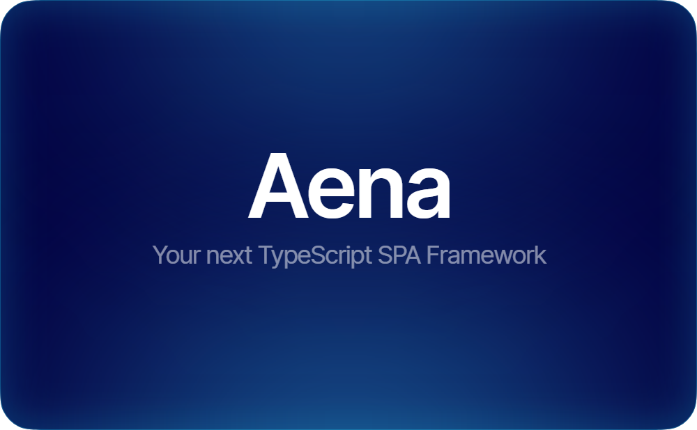

# Aena



> [!WARNING]
> Still in beta. Do not use in production. Inherently unstable api, no guarantees made.

Aena is your next SPA TypeScript framework. It comes with components, flexible built-in state management and TSX support.

## Installation

Via [template](https://github.com/trombecher/aena-template). Instruction are [here](https://github.com/trombecher/aena-template).

You can also install [Aena](https://www.npmjs.com/package/aena) directly via NPM:

```shell
npm i aena
```

```shell
pnpm i aena
```

## Docs

### [Quickstart Guide](./QUICKSTART.md)

## This Package Does _Not_ Throw!

There are no throw expressions in `aena` because I believe that errors should be handled via returns types.
Also `try-catch` blocks have the worst syntax.

## Thanks

Huge thanks to [SolidJS](https://github.com/solidjs/solid/tree/main/packages/solid) for the types because extracting the types from specifications is very tedious. I also thank [React](https://github.com/facebook/react) for inspiration for the quickstart guide.