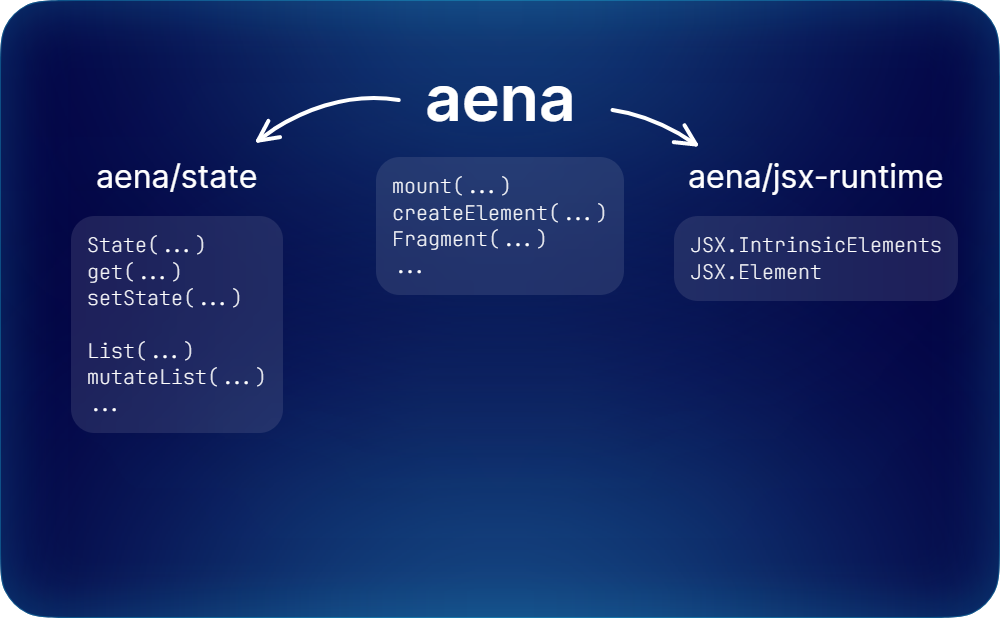

Welcome to the Aena documentation!

---

Aena is a frontend framework for building [single page applications](https://developer.mozilla.org/en-US/docs/Glossary/SPA) in [TypeScript](https://www.typescriptlang.org/).

## Handy Resources

- This documentation
- [The TypeScript documentation](https://www.typescriptlang.org/docs/)
- [MDN Web Docs](https://developer.mozilla.org/en-US/)
- [The Aena source](https://github.com/Trombecher/aena/src)

## Structure Of Aena

The top-level module contains functions creating / operating on UI including state integrations. This module **needs DOM and DOM.Iterable libraries**.

`aena/state` contains all state including `List`. This module is **decoupled from ALL dependencies and other Aena modules**, needing just the ESNext library, which is default for JavaScript runtimes. Therefore, this submodule is not restricted to the browser.

The `aena/jsx-runtime` contains only type definitions (for TSX to properly work).